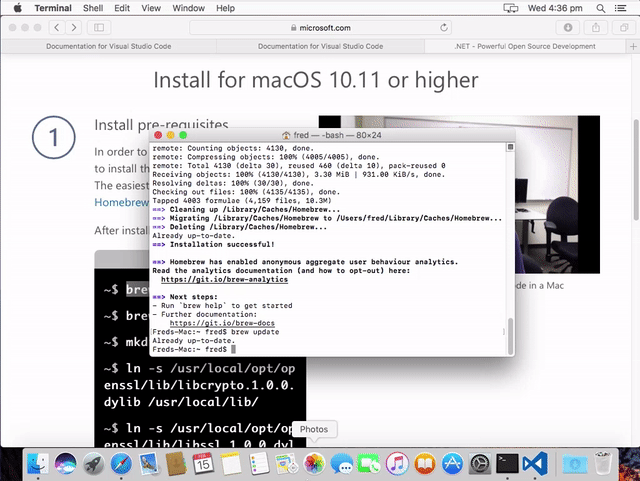

# Getting SplashKit installed on your system.

1. Open the terminal. *Applications/utilities/Terminal* and inside it, execute: `xcode-select --install`.

    

1. In your Terminal, paste and run the following line: `bash <(curl -s https://raw.githubusercontent.com/splashkit/skm/master/install-scripts/skm-install.sh)`. Found at `splashkit.io`.

    

1. Restart the terminal and execute `skm` in the terminal to test SplashKit was successfully installed.

    

1. Download `Visual Studio Code`, found at [code.visualstudio.com](https://code.visualstudio.com).

    

1. Install Visual Studio Code.

    

1. Install the [dotnet core library](https://microsoft.com/net/core), and follow the installation steps. Firstly, we need to install the [Brew Package Manager](https://brew.sh).

    

1. And execute it in the terminal

    

1. Then copy each line of the install pre-requisites.

    

1. Continue on executing the install pre-requisites on the dotnet core page by copy-pasting the commands.

    

1. Install dotnet core SDK.

    

1. Run the installer.

    

1. To test if dotnet was installed successfully, execute the command: `dotnet` into your terminal.

    If you see `command not found`, don't worry! Executing `ln -s /usr/local/share/dotnet/dotnet /usr/local/bin` should fix it.

    

## What's next?
Congratulations! If you've followed these steps correctly, then you will have installed all the tools needed for SIT771.

Don't worry if you run into any problems, just head over to the [forum](http://sit771-discourse.it.deakin.edu.au/) and we'll be able to help you out!